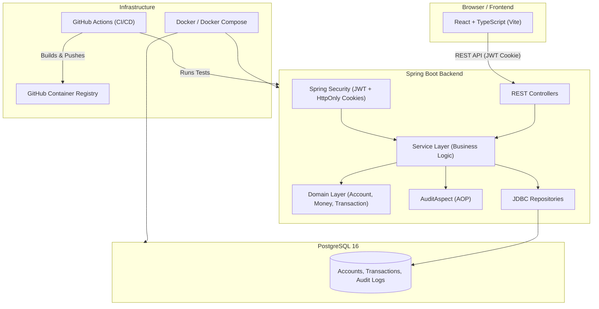

# 🏦 Multithreaded Banking System

[](https://github.com/sandeepp712/Banking-System_v2/actions/workflows/pr-checks.yml)
[](https://github.com/sandeepp712/Banking-System_v2/actions/workflows/docker-publish.yml)
[](https://opensource.org/licenses/MIT)
[](https://adoptium.net/)
[](https://spring.io/projects/spring-boot)
[](https://reactjs.org/)
[](https://www.postgresql.org/)

---

## 📖 Overview

**A production‑grade, full‑stack banking system** built with **Spring Boot** and **React**. This project demonstrates a secure, resilient, and highly concurrent banking core that handles money transfers with strict idempotency, pessimistic locking (`SELECT ... FOR UPDATE`), comprehensive audit logging, and a fully automated CI/CD pipeline.

The system supports:
- **User authentication & authorization** (JWT with RSA 256, `HttpOnly` cookies).
- **Account management** – view balances, list accounts.
- **Secure money transfers** – idempotent (prevents double‑spending), with daily withdrawal limits.
- **Transaction history** – complete audit trail.
- **Automated audit logging** (AOP) – captures "before" and "after" states of every financial transaction.
- **Containerized deployment** – Docker + Docker Compose.
- **CI/CD pipeline** – GitHub Actions (PR checks + Docker image build/push to GHCR).

---

## 🏗️ Architecture Overview



## 🛠️ Tech Stack

### Backend

| Layer | Technology                                       |
| :--- |:-------------------------------------------------|
| **Language** | Java 21                                          |
| **Framework** | Spring Boot 3.x, Spring Security                 |
| **Database** | PostgreSQL 16                                    |
| **Migrations** | Flyway                                           |
| **Security** | JWT (RSA 256), BCrypt, HttpOnly Cookies          |
| **Concurrency** | ReentrantLock + PostgreSQL SELECT ... FOR UPDATE |
| **Logging** | SLF4J + Logback (MDC Correlation IDs)            |
| **Monitoring** | Spring Boot Actuator, Micrometer (Prometheus)    |
| **Testing** | JUnit 5, Mockito, Testcontainers                 |
| **Containerization** | Docker (Multi‑stage builds)                      |

### Frontend

| Layer | Technology |
| :--- | :--- |
| **Framework** | React 18, TypeScript |
| **Build Tool** | Vite |
| **Styling** | Tailwind CSS |
| **HTTP Client** | Axios (with interceptors) |
| **Routing** | React Router DOM v6 |
| **State** | React Context (Auth) |
| **Security** | HttpOnly cookies (XSS‑safe) |

### DevOps

| Tool | Purpose |
| :--- | :--- |
| **GitHub Actions** | CI/CD (PR checks + Docker image build/push) |
| **GitHub Container Registry (GHCR)** | Docker image storage |
| **Docker Compose** | Local development stack |
| **PostgreSQL** | Production‑grade relational database |


# 🚀 Quick Start (Docker Compose)

The fastest way to run the entire stack (frontend + backend + PostgreSQL) is with Docker Compose.

## Prerequisites

* **Docker** (v24+) and **Docker Compose** (v2+)
* **Git**

## Steps

1. **Clone the repository:**
   ```bash
   git clone [https://github.com/sandeepp712/Banking-System_v2.git](https://github.com/sandeepp712/Banking-System_v2.git)
   cd Banking-System_v2
   ```

2. **Create a `.env` file:**
   ```bash
   cp .env.example .env
   ```
   *Then edit `.env` and fill in your credentials (database passwords, JWT keys, etc.).*

3. **Build and run the entire stack:**
   ```bash
   docker-compose up --build
   ```

4. **Access the application:**
    * **Frontend:** `http://localhost:5173`
    * **Backend API:** `http://localhost:8080`
    * **Actuator (Health/Metrics):** `http://localhost:8080/actuator/health`


5. **Get Started:**
   Register a user via the frontend (or using `curl`/Postman) and start banking!


## 💻 Local Development (Without Docker)

If you prefer to run the backend and frontend separately for faster development:

### Backend

1. **Install PostgreSQL 16** locally (or use a Docker container for the DB only).
2. **Create a database:**
   ```bash
   createdb banking_db
   ```
3. **Configure environment variables in `backend/.env`:**
   ```env
   DB_HOST=localhost
   DB_NAME=banking_db
   DB_USER=your_user
   DB_PASSWORD=your_password
   JWT_PUBLIC_KEY=...
   JWT_PRIVATE_KEY=...
   ```
4. **Build and run:**
   ```bash
   cd backend
   ./mvnw spring-boot:run
   ```
   *Flyway will automatically run the migrations.*

### Frontend

1. **Install dependencies:**
   ```bash
   cd frontend
   npm install
   ```
2. **Set up environment variables (create `frontend/.env`):**
   ```env
   VITE_API_URL=http://localhost:8080/api/v1
   ```
3. **Start the development server:**
   ```bash
   npm run dev
   ```
   *The frontend will be available at `http://localhost:5173`.*


## 🔐 Environment Variables

A template is provided in `.env.example` at the project root. Copy it to `.env` and fill in your values.

| Variable | Description | Example |
| :--- | :--- | :--- |
| `DB_HOST` | PostgreSQL hostname | `postgres` (Docker) or `localhost` |
| `DB_NAME` | Database name | `banking_db` |
| `DB_USER` | Database username | `bank_user` |
| `DB_PASSWORD` | Database password | `SuperSecure123!` |
| `JWT_PUBLIC_KEY` | RSA Public Key (Base64) | `MIIBIjAN...` |
| `JWT_PRIVATE_KEY` | RSA Private Key (Base64) | `MIIEvwIB...` |

> ⚠️ **Warning:** Never commit the `.env` file to Git. It is already ignored via `.gitignore`.


## 🧪 Testing

The project includes both unit and integration tests.

### Backend Tests

```bash
cd backend
./mvnw test                     # Unit tests
./mvnw verify                   # Integration tests (with Testcontainers)
```

## 🤖 CI/CD Pipeline (GitHub Actions)

The project uses GitHub Actions for continuous integration and deployment.

### 1. PR Pipeline (`.github/workflows/pr-checks.yml`)

* **Trigger:** Every pull request to `main`.
* **Steps:**
   1. Checkout code.
   2. Setup JDK 21.
   3. Cache Maven dependencies.
   4. Spin up a temporary PostgreSQL container (services).
   5. Run `mvn clean test` (unit + integration tests).
   6. If tests fail, the PR is blocked.

### 2. Main Pipeline (`.github/workflows/docker-publish.yml`)

* **Trigger:** Push to `main` (after PR merge).
* **Steps:**
   1. Checkout code.
   2. Setup JDK 21.
   3. Run tests (safety double‑check).
   4. Build the Docker image using multi‑stage Dockerfile.
   5. Tag the image with the Git commit SHA (e.g., `f3a4b2c`).
   6. Push to GitHub Container Registry (GHCR).

> 💡 **Why the SHA tag?** It ensures a 1:1 link between the source code and the running container, enabling reliable rollbacks and audits.


## 📊 Monitoring & Observability

The backend exposes Spring Boot Actuator endpoints:

| Endpoint | Description |
| :--- | :--- |
| `/actuator/health` | Liveness/readiness probes for Kubernetes. |
| `/actuator/metrics` | Custom metrics (transfer success/failure, idempotency hits). |
| `/actuator/prometheus` | Prometheus scrape endpoint. |
| `/actuator/flyway` | Flyway migration status. |
| `/actuator/info` | Application information. |

### Custom Metrics (Micrometer)

* `bank.transfers.success` – Total successful transfers.
* `bank.transfers.insufficient_funds` – Rejected due to insufficient balance.
* `bank.transfers.idempotency_hit` – Duplicate requests blocked.

## 🤝 Contributing

Contributions are welcome!

### Quick Contribution Flow

1. **Fork** the repository.
2. **Create a feature branch:**
   ```bash
   git checkout -b feature/amazing-feature
   ```
3. **Commit your changes:**
   ```bash
   git commit -m 'Add some amazing feature'
   ```
4. **Push to the branch:**
   ```bash
   git push origin feature/amazing-feature
   ```
5. **Open a Pull Request.**

---

## 🙏 Acknowledgements

* **Spring Boot** – For the robust backend framework.
* **React + Vite** – For the fast and modern frontend.
* **PostgreSQL** – For the reliable relational database.
* **Flyway** – For database migrations.
* **Testcontainers** – For integration testing with real databases.
* **GitHub Actions** – For the CI/CD pipeline.

---

## 📬 Contact

For questions or feedback, please open an issue on **GitHub Issues**.